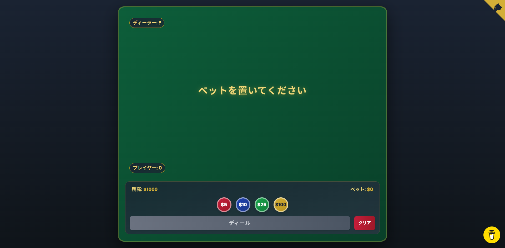

# ブラックジャック / Blackjack

## 概要 / Overview

Opalを使用して作成されたスタイリッシュなブラックジャックWebアプリです。

A stylish Blackjack web app created with Opal.

## 作成日 / Creation Date

2025-10-18

## 説明 / Description

このアプリは、クラシックなカジノゲーム「ブラックジャック」をブラウザで楽しめるWebアプリケーションです。美しいUIと滑らかなアニメーションで、本格的なカジノ体験を提供します。

**作成の背景 / Background**  
学校の文化祭でクラスがカジノをテーマにした際、数あるカジノゲームの中でも特に難しいとされる「ブラックジャック」のルールや戦略を、スマートフォンから手軽に練習できるようにするために開発しました。

ブラックジャックは一見シンプルに見えますが、実は非常に奥深いゲームです。運の要素も大きいものの、場に出ているカードを常に把握し、自分の手札と照らし合わせながら、リスクとリターンを考え続ける必要があります。この戦略的な思考こそが、ブラックジャックの真の魅力です。

このアプリは [Opal](https://opal.withgoogle.com) を使用して作成されました。

This is a web application that brings the classic casino game "Blackjack" to your browser. With a beautiful UI and smooth animations, it provides an authentic casino experience.

**Background**  
This app was developed for a school cultural festival where our class created a casino-themed experience. Among various casino games, Blackjack is considered one of the most challenging. This app was created to help people easily practice Blackjack rules and strategies from their smartphones.

While Blackjack may appear simple at first glance, it is actually a deeply strategic game. Though luck plays a significant role, players must constantly track the cards on the table, compare them with their own hand, and continuously evaluate risks and returns. This strategic thinking is the true appeal of Blackjack.

## 機能 / Features

- 💰 ベットシステム - $5, $10, $25, $100のチップでベット可能
- 🃏 本格的なブラックジャックルール - ヒット、スタンド、ダブルダウン、スプリットに対応
- 🌍 多言語対応 - 日本語/英語の切り替え機能
- 🎨 カジノテーマのデザイン - ラグジュアリーなゴールド&ネイビーの配色
- 📱 レスポンシブデザイン - モバイルからデスクトップまで最適表示
- ✨ 滑らかなカードアニメーション - ディール時のアニメーション効果
- 💵 残高管理システム - 初期残高$1000からスタート
- 🎯 リアルタイムスコア表示 - 各ハンドの合計値を即座に表示
- 🎲 マルチデッキ対応 - 6デッキ使用でリアルなカジノ体験
- 📲 **PWA対応** - モバイルデバイスにアプリとしてインストール可能（フルスクリーン表示）
- 🔄 **オフライン対応** - Service Workerによるキャッシングで一度アクセスすればオフラインでも動作

## 使用方法 / How to Use

### 基本的なプレイ方法

1. **ベットを置く** - 画面下部のチップをクリックしてベット額を選択
2. **Dealボタンをクリック** - ゲームが開始され、プレイヤーとディーラーにカードが配られます
3. **アクションを選択**
   - **Hit**: もう1枚カードを引く
   - **Stand**: 現在の手札で勝負
   - **Double**: ベットを2倍にして1枚だけカードを引く
   - **Split**: 同じ数字のカードを2つの手札に分ける（可能な場合のみ）
4. **結果を確認** - 21に近い方が勝利！
5. **New Hand** - 新しいラウンドを開始

### 📲 PWAとしてインストール（推奨）

モバイルデバイスのホーム画面にアプリとして追加することで、ブラウザのUIなしでフルスクリーン体験ができます。

**iOS (Safari)**

1. Safariでアプリを開く
2. 共有ボタン(□↑)をタップ
3. 「ホーム画面に追加」を選択
4. 「追加」をタップ

**Android (Chrome)**

1. Chromeでアプリを開く
2. メニュー(⋮)を開く
3. 「ホーム画面に追加」または「アプリをインストール」を選択
4. 「インストール」をタップ

詳しいPWAセットアップガイドは [PWA_SETUP.md](./PWA_SETUP.md) を参照してください。

## スクリーンショット / Screenshots



## ファイル構造 / File Structure

```text
blackjack/
├── README.md              # このファイル / This file
├── PWA_SETUP.md           # PWAセットアップガイド / PWA setup guide
├── index.html             # メインHTMLファイル / Main HTML file
├── manifest.json          # PWAマニフェスト / PWA manifest
├── service-worker.js      # Service Worker / Service worker
├── assets/
│   ├── css/
│   │   └── style.css     # カスタムスタイル(カジノテーマ) / Custom styles (Casino theme)
│   ├── js/
│   │   ├── script.js     # コアゲームロジック / Core game logic
│   │   ├── game.js       # UI制御とイベント処理 / UI control and event handling
│   │   └── i18n.js       # 国際化モジュール / Internationalization module
│   └── images/
│       ├── icon-*.png           # PWAアイコン(各サイズ) / PWA icons (various sizes)
│       ├── icon-generator.html  # アイコン生成ツール / Icon generator tool
│       └── generate-icons.js    # Node.jsアイコン生成スクリプト / Node.js icon generator
```

## 技術スタック / Tech Stack

- HTML5
- CSS3 (カスタムプロパティによるテーマシステム / Theme system with CSS custom properties)
- JavaScript (Vanilla) - モジュール化されたアーキテクチャ / Modularized architecture
- Tailwind CSS (CDN) - ユーティリティファーストスタイリング / Utility-first styling
- Google Fonts (Poppins) - モダンなタイポグラフィ / Modern typography

### アーキテクチャ / Architecture

- **script.js**: コアゲームロジック（デッキ生成、カード計算、ルール処理）
- **game.js**: UI制御、状態管理、イベントハンドリング
- **i18n.js**: 多言語対応システム（localStorage永続化）

### 開発について / Development

このプロジェクトは主にAIによって開発されました。Opalがゲーム設計、初期デザイン、基盤作成を担当し、GitHub Copilotが機能の強化、洗練、拡張を行いました。

This project was primarily developed by AI. Opal designed the game structure, initial design, and created the foundation. GitHub Copilot enhanced, refined, and extended the functionality.

## リンク / Links

- [Opal プロジェクト / Opal Project](https://opal.withgoogle.com)
- [デモサイト / Demo](https://app-with-opal.toaki.cc/apps/blackjack)

## ライセンス / License

MIT

## 作者 / Author

- 桐生トア / Toa Kiryu

## 備考 / Notes

このアプリは文化祭での実践的な利用を想定して設計されており、初心者でも直感的に操作できるUI/UXを重視しています。スマートフォンでの操作性を第一に考え、レスポンシブデザインを採用しています。

カジノの雰囲気を再現するため、ゴールドとネイビーを基調とした高級感のある配色と、滑らかなアニメーションを実装しました。多言語対応により、日本語話者だけでなく英語話者も楽しめるようになっています。

This app is designed for practical use at school festivals, with a focus on intuitive UI/UX that even beginners can easily operate. It prioritizes smartphone usability and adopts a responsive design.

To recreate the casino atmosphere, we implemented a luxurious color scheme based on gold and navy, along with smooth animations. With multilingual support, the app can be enjoyed by both Japanese and English speakers.

### カラーテーマ / Color Theme

- **Casino Green** (`#0d5e3a`) - メインテーブルカラー / Main table color
- **Gold** (`#d4af37`) - ラグジュアリーアクセント / Luxury accents
- **Navy** (`#1a2332`) - 洗練されたコントラスト / Sophisticated contrast
- **Casino Red** (`#c41e3a`) - チップとアクセント / Chips and accents
